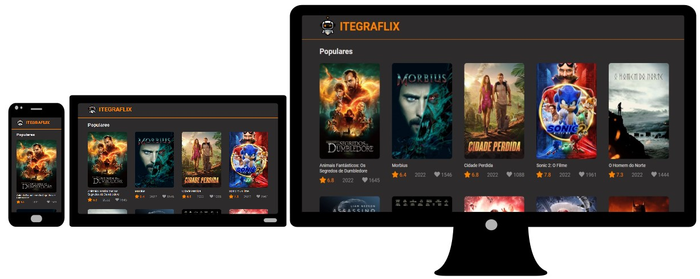

[ITEGRAFLIX](https://miltcn.github.io/itegra-flix/)
--
Aplicação React que lista os 10 filmes mais populares do momento com base nos dados fornecidos pelo o  [TMBD](https://www.themoviedb.org/).

<p align="center"> 


</p>
<p align="center">
<a href="#Desmonstração">Demonstração</a> | <a href="#Tecnologias">Tecnologias </a> | <a href="#Instalação">Instalação</a> 
</p>

## :computer: Demonstração da aplicação

### Demo do design responsivo
<p>A responsividade foi desenvolvida com base nos breakpoints do <a href="https://getbootstrap.com/docs/5.0/layout/breakpoints/">Bootstrap v5.0.</a></p>



### Link da aplicação 
🔗 https://miltcn.github.io/itegra-flix/


## 🛠️ Tecnologias utilizadas
|  **Tecnologia**| **Versão** |
|:------------------ | ------------------|
|[npm](https://docs.npmjs.com/) |18.1.0|
|[React](https://reactjs.org/) |18.1.0|
| [TypeScript](https://www.typescriptlang.org/) | 4.7.3 | 
| [Axios](https://github.com/axios/axios) | 0.27.2 | 
| [React Router Dom](https://github.com/ReactTraining/react-router/tree/master/packages/react-router-dom) | 6.3.0 | 
| [React Loader Spinner](https://www.npmjs.com/package/react-loader-spinner) | 5.1.5 | 
[Gh-pages](https://www.npmjs.com/package/gh-pages) | 4.0.0 | 


##  🚀 Instalação
### Pré-requisitos
Para executar este projeto é necessário ter previamente instalado em sua máquina as seguintes ferramentas: [Git](https://git-scm.com/), [Node.js](https://nodejs.org/en/) e um editor código como [VSCode](https://code.visualstudio.com/).

> A aplicação consome a API do TMDB. Obtenha uma key de acesso seguindo as orientações da documentação. 
> 
> [Documentação da API do TMDB](https://developers.themoviedb.org/4/getting-started)

### Como executar

```bash
# Clone este repositório
$ git clone https://github.com/miltcn/itegra-flix.git

# Instale as dependências (pelo terminal/cmd)
$ npm install

# Acesse a pasta do projeto com VSCode e crie um arquivo chamado .env na raiz
# do projeto, depois insira a seguinte linha:
 REACT_APP_API_KEY="sua api key"

# Execute a aplicação (pelo terminal/cmd)
$ npm run start

# A aplicação será aberta na porta:3000 
- Acesse por http://localhost:3000

```